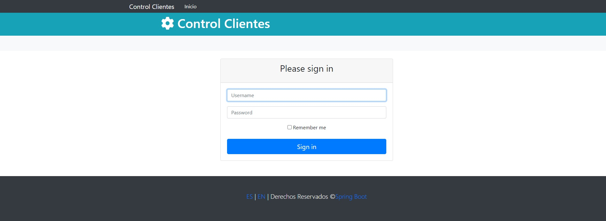
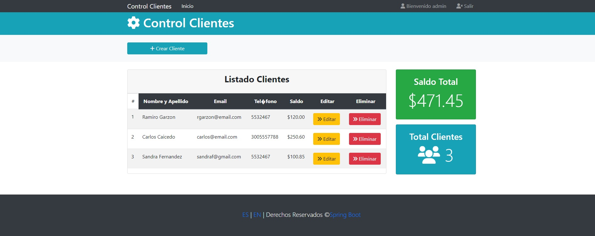
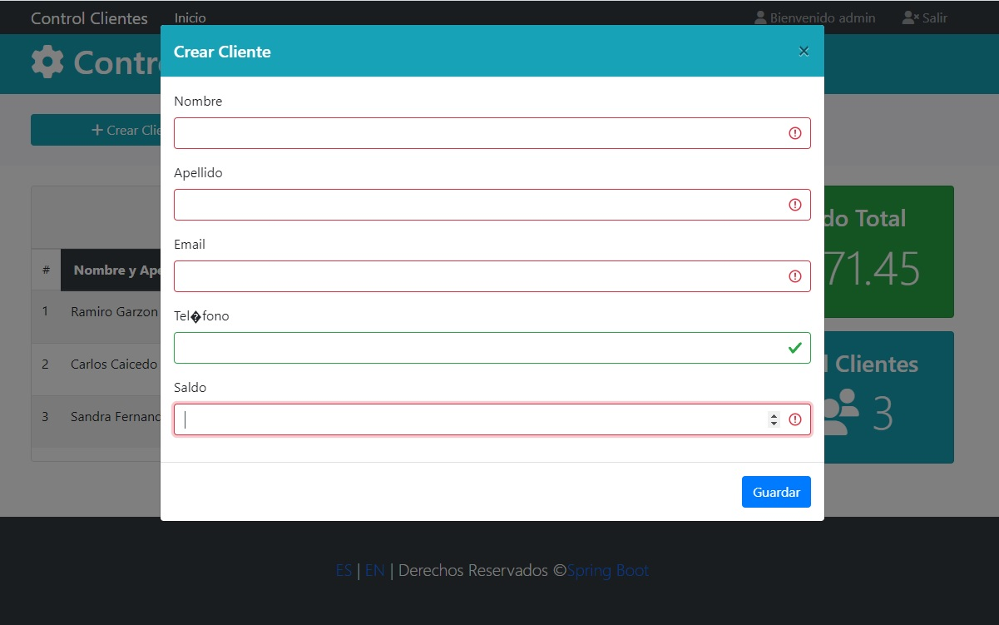

# Java-SpringBoot-MySQL-Bootstrap-ControlClients
Pequeño proyecto de práctica utilizando Java y Spring Boot.

## Libraries
- Spring Boot
- Thymeleaf
- Spring Security
- Bootstrap
- MySQL Driver
- Validation

## Output
 ### Page Login

### Page Home

### Page Create Client

### Page 403

